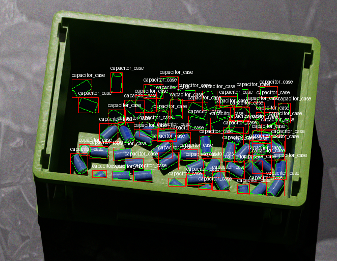

# COCO Writer for NVIDIA Omniverse Replicator

This package provides a COCO Writer for NVIDIA Omniverse Replicator that exports bounding boxes and segmentation data in COCO format.

## Features

- Export RGB images
- Export instance segmentation masks
- Export bounding boxes
- Custom filtering for semantic segmentation
- Support for custom annotations and licenses

## Installation

There are two ways to install the COCO Writer:

### Method 1: Copy to Working Directory

Simply copy the `coco_writer.py` file to your project's working directory. The writer will be automatically available in your Replicator scripts.

### Method 2: Install to Python Environment

To make the writer available across all your projects:

1. Copy the `coco_writer.py` file to your Python environment's site-packages directory
2. Ensure the file is in a location on your Python path

After installation, you can import and use the writer as shown in the usage examples below.

## Usage

Basic usage example:

```python
import omni.replicator as rep
import coco_writer

# Get the writer
writer = rep.WriterRegistry.get("COCOWriter")

# Set output directory
out_dir = "./path/to/dir"

# Initialize the writer with desired options
writer.initialize(
    output_dir=out_dir,
    rgb=True,
    instance_segmentation=True,
    bbox=True,
    semantic_filter_predicate=filter_predicate
)

```

### Custom Annotations and Licenses

You can add custom information and licenses to the COCO dataset by providing base dictionaries:

```python
# Custom info
custom_info = {
    "description": "My custom dataset",
    "url": "https://github.com/myusername/mydataset",
    "version": "1.0",
    "year": 2023,
    "contributor": "My Name",
    "date_created": "2023/05/10"
}

# Custom licenses
custom_licenses = [
    {
        "id": 1,
        "name": "Attribution-NonCommercial-ShareAlike License",
        "url": "http://creativecommons.org/licenses/by-nc-sa/2.0/"
    }
]

# Initialize with custom info and licenses
writer.initialize(
    output_dir=out_dir,
    rgb=True,
    instance_segmentation=True,
    bbox=True,
    info=custom_info,
    licenses=custom_licenses
)
```

## Output Structure

After running the writer, the following files will be generated:

- `<out_dir>/coco_*.json`: COCO format file
- `<out_dir>/rgb/frame_*.png`: RGB images

## Example Output



## License

This project is licensed under the MIT License - see the LICENSE file for details.